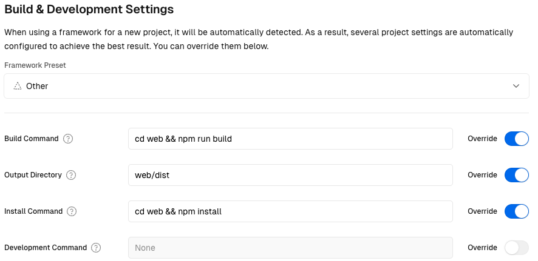

# Conway's Game of Life [Rust 🦀 + WASM 🕸️]

Try it: https://conway-jordi.vercel.app/

## Requirements 

You need to have installed the Rust toolchain `rustup`. On a Unix system:
```sh
curl --proto '=https' --tlsv1.2 -sSf https://sh.rustup.rs | sh
```

You need to have installed `wasm-pack`. On a Unix system:
```sh
curl https://rustwasm.github.io/wasm-pack/installer/init.sh -sSf | sh
```
Using cargo:
```sh
cargo install wasm-pack
```
Using npm:
```sh
npm install -g wasm-pack
```

Finally, you must have [NodeJS](https://nodejs.org/en/download) installed.

## Generate web server code

Generate the WebAssembly binary running this command:
```sh
wasm-pack build
```
This will create a `pkg` directory.

Initialize the NodeJS application:
```sh
npm init wasm-app web
```
This will generate a `web` directory.

Move the `pkg` directory into `web` directory. 
```sh
cp -rf pkg web && rm -r pkg && rm web/pkg/.gitignore
```
Also we removed the `pkg` directory and the `.gitignore` file (for deployment).

## Run the web server

You can start the NodeJS server using the following commands:
```sh
cd web
npm cache clean -f
rm -rf node_modules package-lock.json
npm i
npm run start
```

## Deploy the app

For example, we can use Vercel to deploy our app.

You can deploy it with the following configuration:

